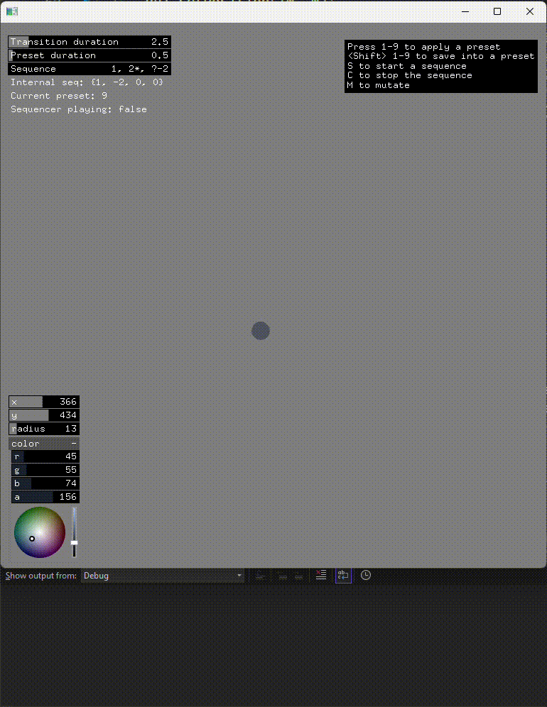

# ofxPresets

## tl;dr

Preset manager and sequencer for openFrameworks

No GUI, JSON file format storage, tested on OF 0.12.0

Special sequencer syntax
    - step seq: 1, 2, 3, 4
    - ranges: 1 - 5
    - random preset: 1, r, 5
    - preset mutation:  5m
    - randomized repetition: ? - 3

---

## Instalation

The usual ofx addons procedure, clone this repo or download it and uncompress it on your addons folder.


## Usage

[Full example included](ofxPresets-example/src/ofApp.cpp)

Overall steps to use the addon:

0. Import

```cpp
#include "ofxPresets.h"
```

1. Define your ofParameters and group them [see all options](#how-to-pass-the-parameters-to-the-manager)

The most standard way is using an ofParameterGroup

```cpp
ofParameterGroup group;
ofParameter<int> x;
...
group.setName("myParams");
group.add(x.set("x", 0, 100));
```

2. Create the presets manager and pass parameters to it

```cpp
    ofxPresets manager;
...
   manager.setup( myParams );
```

3. Add the manager to the update loop

```cpp
void ofApp::update(){
    manager.update();
}
```

4. Use it!

- `savePreset(int presetID)` to save the current values into the preset json file
- `applyPreset(int presetID, float interpolationDuration)` to load the preset json file and apply the values into the preset objects

[See interpolation parameters](#interpolation-parameters)

Basic commands example:

```cpp
void ofApp::keyReleased(ofKeyEventArgs& e) {
    if (e.keycode >= '1' && e.keycode <= '9') {
        int index = e.keycode - '1' + 1; // convert to int by removing the ascii offset

        if (e.hasModifier(OF_KEY_SHIFT)) {
            manager.savePreset(index);
        }
        else {
            manager.applyPreset(index);
        }
    }

    if (e.keycode == 'S') {
        manager.loadSequence(ofToString(sequenceInput.get()));
        manager.playSequence();
    }

    if (e.keycode == 'C') {
        manager.stop();
    }

    if (e.keycode == 'M') {
        manager.mutate();
    }
}
```

]

## Interpolation parameters

Interpolation happens when applying presets, either directly or when sequencing.

To control the interpolation time use
```cpp
ofParameter<float> manager.interpolationDuration;
```

Within that time, **all parameter values** are interpolated using an easing function. 
QuadInOut by default.

This can be changed to any other easing function from the included ofxSEeasing class (or your own).

```cpp
// setEasingFunction(std::function<float(float)> func);
manager.setEasingFunction(ofxSEeasing::easeInOutCubic);
```


## How to pass the parameters to the manager

The desired parameters to be managed as presets should be provided in groups, using the `setup()` method.

```cpp
    manager.setup( myParams );
```

You can provide a single parameter group or an `std::vector<>` of parameter groups.

Two different group types are supported: the standard ofParameterGroup and the provided ofxPresetsParametersBase,

### Use ofParameterGroup

The well known ofParameterGroup to group your parameters,

Requires to set the group name and initialize all parameters before passing them to the manager

```cpp
ofParameterGroup group;
group.setName("myParams");
ofParameter<int> x;
group.add(x.set("x pos", 0, 100));
```

### Use the provided ofxParameterBase structure

This is a wrapper class that may be handy to add extra logic to the group,
like initializing the parameters, create resets, etc.

```cpp
struct Params : public ofxPresetsParametersBase {
public:
    ofParameter<int> x;
    Params() {
        groupName = "myParams";
        parameterMap["x"] = &x.set("x pos", 0);
        parameterMap["y"] = &y.set("y pos", 0);
    }
    void reset() {
        x = 0;
        y = 0;
    }
    void swap() {
        if (x>0 && y>0) { std::swap(x, y); }
        else { reset(); }
    }
}
```

_The manager uses this ofxParameterBase class internally to store all parameter references_

## Sequencer

The sequencer allows to playback a sequence of presets.

Main functions with self explanatory names:
- `.loadSequence(std::string)` to load a sequence string [see sequence string](#the-sequence-string)]
- `.playSequence()` to play the loaded sequence
- `.stopSequence()` to stop only the sequence playback
- `.stop()` to stop all playback and interpolation (the interpolation and sequence playing)

### Sequencer times

[See interpolation parameters](#interpolation-parameters)]

There are two main time values to control the sequencer:
- The transition time when applying presets: `manager.interpolationDuration`
- The time spent between steps, meaning the time a preset waits until a new transition start: `manager.sequencePresetDuration`

### The sequence string

The sequence string is a regular string with the comma separated step presets: `1, 2, 3, 4`

Must be loaded using `loadSequence(std::string)` method or modifying the [internal sequence vector](#sequence-internals)]

There are special syntax tokens for:
- Ranges: `1 - 5`, will play presets 1, 2, 3, 4, 5 and loops from the begining
- Random preset: `1, ?, 5`, will take ? and replace it for a random available preset
- Randomized range: `? - 3`, will repeat a random preset 3 times
- Preset mutation:  `5*`, will apply the preset #5 in a mutated fashion

#### Sequence internals

The provided sequence string is parsed and stored in an internal vector of integers right before playback.

The unrolled sequence is available in the manager in `ofParameter<std::vector<int>> sequence;`

When unrolling the special tokens are replaced in the internal sequence vector:
- `?` is replaced by `0`
- `*` is replaced by the negative preset number `-#`

## Mutation

A mutation feature is available to apply small changes to parameters without the need to save a new preset.

Can be called from the current parameter state (without an actual preset applied or defined!)

```cpp
void mutate();
void mutate(float percentage = 0.1f);
```

or from a preset:

```cpp
void mutateFromPreset(int id, float percentage);
```

The default mutation percentage can be defined by updating `ofParameter<float> mutationPercentage;`

The mutation uses a simple gauss random distribution to add a small random value to the current parameter value as follows

```cpp
float range = maxValue - minValue;
float mutation = ofRandomGaussian(0.0f, mutationPercentage / 4) * range;
float mutatedValue = currentValue + mutation;
```

## Events

To follow the workflow of presets and sequence steps, there are a couple of handy events you can listen to:

- `ofEvent<void> sequencePresetFinished` Notifies after the defined time for a preset in the sequencer ended [see sequencer times](#sequencer-times)
- `ofEvent<void> sequenceFinished;` Notifies when the sequence playback is finished
- `ofEvent<void> presetAppicationStarted;` Notifies when a preset interpolation starts
- `ofEvent<void> transitionFinished;` Notifies when the interpolation transition fully finished, both for direct preset application and sequencer step

No data is send on the notification (notification logs are printed), but useful information can be retrieved from the manager:
```cpp
ofParameter<std::vector<int>> sequence;
int getCurrentPreset();
bool isInterpolating();
bool isPlayingSequence();
int getSequenceIndex();
```

Events example:
```cpp
ofAddListener(manager.transitionFinished, this, &ofApp::onPresetChanged);
...
void ofApp::onPresetChanged() {
	ofLog() << "Recieving preset changed event, now #" << manager.getCurrentPreset();
}
```

## The JSON file

Each preset is saved in two digits json file: `01.json`, `02.json`, etc.

Json files contains all the parameters and parameter groups in the same parameter file.

The json file follows the same structure as the parameter group, with the first level being the group name.

Nested groups not supported.

JSON example:

```json
{
    "simulation": {
        "particles": 5000,
        "mass": 3,
        "thermostat": 0.1
    },
    "render": {
        "color": 7247871,
        "color_alpha": 128
    }
}
```

Set json file path with `manager.setPresetPath(std::string path);`

